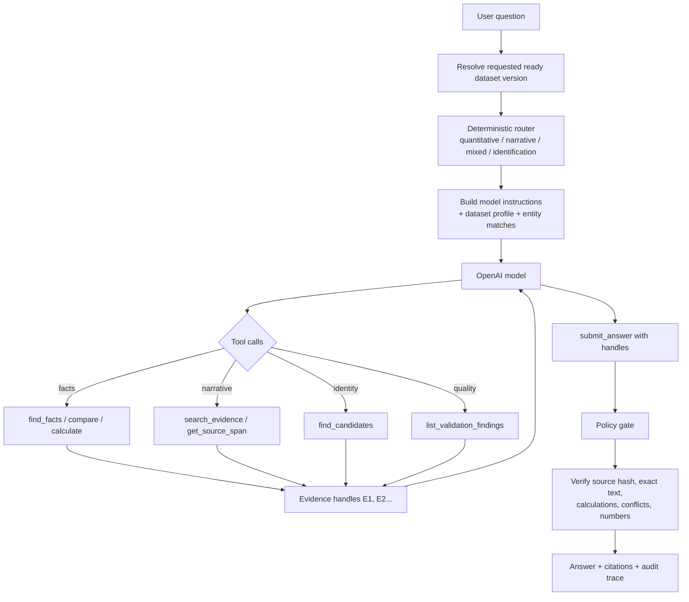

The current router has four actual route types:

| Route type | Detection | Initial instruction to the model |
| --- | --- | --- |
| `quantitative` | Number/metric language such as revenue, EPS, percentage, compare, growth | Start with `find_facts`; use `calculate` for arithmetic |
| `narrative` | “why,” “what drove,” risk, outlook, explanation | Start with `search_evidence` |
| `mixed` | Both quantitative and narrative signals | Use facts for numbers and search for explanation |
| `identification` | Long question starting with “Which” | Split into clues; call `find_candidates`, then verify candidates |

There is also a broader `QuestionCategory` enum with ten domain-level categories—lookup, comparison, calculation, narrative, cross-report, conflict, currency ambiguity, decline, false premise, and identification—but the live router does not yet classify into all ten individually. It emits the four route types above. [models.py](/Users/pravinpaudel/Downloads/ai-harnesss-htn-2026/contracts/models.py:150)

End-to-end, the flow is:

In plain terms:

1. `htn ask` selects one ready corpus version. Every lookup is scoped to that version and its corpus hash.

2. The router examines the wording with regex rules and obtains a compact dataset profile: documents, entities, metrics, periods, currencies, and open findings.

3. It gives the model a route hint, but it does not let the model access PostgreSQL directly. The model receives a fixed tool set:

   - `find_facts`
   - `search_evidence`
   - `find_candidates`
   - `get_source_span`
   - `calculate`
   - `compare_values`
   - `list_validation_findings`
   - `check_coverage`
   - `submit_answer`

   The complete registry is in [registry.py](/Users/pravinpaudel/Downloads/ai-harnesss-htn-2026/app/tools/registry.py:493).

4. The model chooses tools. For an identification question like yours, it first asks `find_candidates` with clues such as “13% beat,” “AML remediation,” and “asset cap.” That tool performs deterministic corpus searches and ranks companies; it does not ask the model to invent candidates.

5. Each tool result registers source-backed evidence under an internal handle such as `E7`. A handle includes its document, exact source span, original hash, and—when relevant—typed numeric metadata.

6. The model iterates: request evidence → inspect results → request more evidence → submit an answer. The engine enforces limits on tool rounds, tokens, latency, and cost. [engine.py](/Users/pravinpaudel/Downloads/ai-harnesss-htn-2026/app/reasoning/engine.py:53)

7. When the model calls `submit_answer`, it must cite only evidence handles it received. The policy layer reconstructs citations from those handles; it does not trust citation text supplied by the model.

8. The policy gate then verifies:
   - cited text is verbatim at the recorded offsets;
   - the source document hash matches the immutable snapshot;
   - calculations cite their source operands;
   - numeric claims have support;
   - relevant stored conflicts are surfaced;
   - cross-currency ordering is not presented as valid without a source-backed conversion.

9. The answer is returned as `answered`, `partial`, `conflict`, or `declined`, and every model turn/tool call/policy change is written to `answer_run` and `tool_event`. That is what `htn trace` displays.

So the LLM is the investigator and writer, but the router, tools, evidence handles, verifier, and policy gate constrain it to evidence the system can trace back to the immutable corpus.

| Final status | How it happens |
| --- | --- |
| `answered` | Proposed answer has valid citations and no policy issue requires a downgrade. |
| `partial` | Some answer is supported, but there is a limitation—for example an unsupported numeric claim, incompatible currencies in a ranking, or citations that are mostly about the wrong entity. |
| `conflict` | Cited evidence is associated with a recorded validation finding, and the system can build verifiable claims for both sides of that contradiction. |
| `declined` | The model declines, the run exhausts its budget, or no citations survive verification. |

Partial — unsupported number
Question: “What was TD’s revenue growth, and how much did its market share increase?”
The sources support TD’s revenue growth, but contain no market-share number.
Result: partial

Question: “Which company has the larger market cap: Company A at C$30B or Company B at US$32B?”
The system has both numbers, but no USD/CAD conversion in the corpus.
Result: partial
Company A is C$30B [1] and Company B is US$32B [2]. The corpus does not provide a conversion, so they cannot be ranked reliably.

It does not say “B is larger” just by comparing 32 > 30, because the currencies differ.

Conflict — the corpus contradicts itself
Suppose one table says:
IVN beat estimates in 3 of 8 quarters. [1]

But another source section says:
IVN beat estimates in 2 quarters. [2]

Both statements exist in the same stored corpus and are individually verifiable.
Result: conflict
The corpus contains conflicting beat-count claims: 3/8 [1] versus 2 [2].