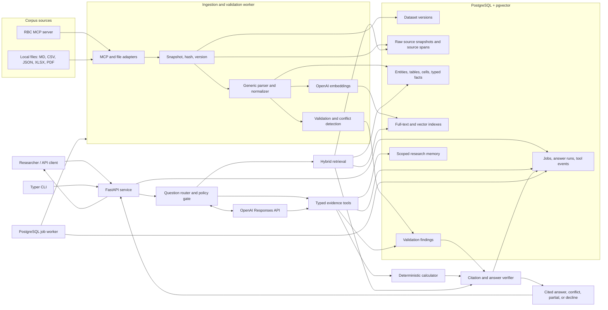

# Finance Research Harness — Implementation Plan

## 1. Product objective

Build an evidence-first research harness that turns an unfamiliar corpus into a
versioned, queryable evidence store. It must answer finance-research questions
with source-grounded citations, show contradictions rather than hide them,
perform calculations reproducibly, and decline questions the source cannot
support.

The system has two required operating modes:

1. **Phase 1 — known corpus:** ingest and evaluate the supplied Canadian
   financials, mining, and technology reports.
2. **Phase 2 — cold-start corpus:** ingest the judging-day industry dataset
   without changing code, prompts, schemas, or manually adding domain facts.

The core promise is not "an LLM that knows finance." It is a system that can
show *why* an answer is supported by a particular version of an uploaded or MCP
retrieved corpus.

## Architecture diagram



## 2. Chosen architecture

### Runtime and infrastructure

Use Python 3.12 and Docker Compose.

| Component | Choice | Responsibility |
|---|---|---|
| API | FastAPI + Pydantic v2 | HTTP API, auth, request validation, OpenAPI docs |
| CLI | Typer + Rich | Ingest, query, evaluation, trace, and local demo workflows |
| Database | PostgreSQL 16 + pgvector | Evidence, full-text search, vectors, memory, jobs, and audit logs |
| ORM/migrations | SQLAlchemy 2 + Alembic | Typed data access and repeatable schema changes |
| Background work | Dedicated Python worker + PostgreSQL jobs table | Long ingests, embeddings, validation, and batch evaluation; no Redis |
| Raw storage | Mounted volume locally; S3-compatible object storage in deployment | Immutable source snapshots and exports |
| LLM | Official OpenAI Python SDK, Responses API | Tool orchestration, question interpretation, and evidence-bound writing |
| MCP | Python MCP client adapter | Dataset discovery and retrieval from the supplied MCP endpoint |

`docker compose up` runs the API, worker, PostgreSQL/pgvector, and optional
local object-storage service. Redis is intentionally not used. The worker
claims jobs with PostgreSQL `FOR UPDATE SKIP LOCKED`, uses idempotency keys, and
records retry/error state in the `job` table. This is sufficient for the
single-region, moderate-throughput evaluation target; a dedicated queue can be
introduced later behind the job repository interface.

### Repository layout

```text
app/
  api/                 FastAPI routes, dependencies, response models
  cli/                 Typer commands
  ingest/              source adapters, parsers, normalization, embeddings
  retrieval/           SQL, full-text, vector, reranking
  tools/               bounded tools exposed to the Responses API
  reasoning/           routing, answer orchestration, policy gate
  validation/          arithmetic, consistency, and citation checks
  memory/              dataset- and session-scoped memory
  audit/               run/event persistence and trace rendering
  db/                  SQLAlchemy models, repositories, migrations
  worker/              PostgreSQL-backed job runner
tests/
  unit/ integration/ evaluation/ fixtures/
docker-compose.yml
```

## 3. Data and provenance model

Every imported corpus is immutable after ingestion. A re-ingest creates a new
`dataset_version`, never overwrites the old version.

| Record | Key fields | Purpose |
|---|---|---|
| `dataset` / `dataset_version` | source type, source URI, source hash, parser version, status | Isolate corpus versions and make answers replayable |
| `document` | dataset version, title, hash, raw object key, metadata | Track each original file or MCP document |
| `source_span` | document, line/character offsets, exact text, heading path | Immutable citation target |
| `chunk` | span, text, token count, embedding, searchable text | Narrative RAG evidence |
| `table` / `table_cell` | header hierarchy, row label, cell value, span | Preserve generic structured source data |
| `entity` / `entity_alias` | canonical label, aliases, dataset version | Resolve names without global assumptions |
| `fact` | entity, metric, value/range, unit, currency, basis, period, role, span | Typed, cited evidence for quantitative work |
| `validation_finding` | rule, severity, involved facts/spans, explanation | Persist contradictions and quality issues |
| `research_memory` | scope, summary/preference, expiry, evidence links | Persist useful context without treating it as fact |
| `job` | type, payload, state, retry count, timestamps | Replace a Redis work queue |
| `answer_run` / `tool_event` | inputs, outputs, tool calls, model, prompt version, cost, latency | End-to-end audit trail |

Facts store `basis` and `role` explicitly. Examples include `gaap`,
`adjusted`, `actual`, `estimate`, `guidance`, `rank`, `target`, `trailing`, and
`quarterly`. Facts also store `period_label` and optional resolved `period_end`.
The system never treats two numbers as comparable merely because their entity,
metric name, and quarter-looking label match.

## 4. Ingestion design

### Source adapters

Implement a common `SourceAdapter` protocol:

```python
class SourceAdapter(Protocol):
    def discover(self) -> SourceCapabilities: ...
    def snapshot(self, request: IngestRequest) -> list[RawDocument]: ...
```

Adapters:

- `McpSourceAdapter`: discovers tools, calls the configured financial-data MCP
  tool, validates its response, snapshots raw payloads, and retries only
  transient transport errors.
- `FileSourceAdapter`: accepts Markdown, CSV, JSON, XLSX, and PDF inputs.

The MCP response shape is not hardcoded. Tool availability, argument schema,
payload type, document count, and source metadata are captured in the ingest
report. A failed MCP call produces a failed job with a diagnostic event; it
does not create a partially valid dataset version.

### Generic extraction pipeline

1. Snapshot raw documents and calculate SHA-256 hashes.
2. Convert each input into a line-preserving canonical text representation.
3. Split into heading-aware blocks, paragraphs, lists, tables, and details/
   summary blocks without assuming section numbers or industry vocabulary.
4. Preserve every table header, row label, cell, and source span.
5. Extract conservative key-value and table-cell facts; leave uncertain prose
   as citable chunks rather than inventing structured values.
6. Normalize numeric text into value, range, sign, scale, unit, currency,
   estimate flag, and qualifier. Preserve the original string in all cases.
7. Infer entities, aliases, periods, and metrics only within the current
   dataset. Mark low-confidence extraction for review instead of silently
   coercing it.
8. Create OpenAI embeddings for chunks and searchable text indexes for chunks,
   table cells, and facts.
9. Run validation rules, generate a quality report, and mark the dataset
   `ready` only after source integrity and database writes succeed.

No LLM is in the critical extraction path. An optional, clearly labelled
LLM-assisted metric-label suggestion may run after deterministic extraction,
but it may only add aliases or annotations; it cannot modify raw values or
source spans.

## 5. Retrieval, skills, and answer execution

### Retrieval strategy

Use hybrid retrieval in a single PostgreSQL-backed evidence store:

1. **Structured lookup:** exact entity, metric, period, role, unit, and
   currency filters against `fact` and `table_cell`.
2. **Lexical search:** PostgreSQL `tsvector` search for exact wording, rare
   names, and phrases.
3. **Semantic search:** pgvector nearest-neighbor retrieval over chunks and
   selected table/fact descriptions.
4. **Reranking:** score candidates using question relevance, metadata match,
   source specificity, and evidence completeness.

The retriever always filters by the requested dataset version. Cross-dataset
retrieval is disabled by default.

### Skills/tool modules

Expose only typed, read-only functions to the OpenAI Responses API:

| Skill/tool | Result |
|---|---|
| `inspect_dataset` | Available entities, metrics, periods, currencies, and warnings |
| `resolve_entity` | Canonical dataset-scoped entity and aliases |
| `find_facts` | Filtered typed facts with source spans |
| `search_evidence` | Hybrid-ranked chunks/table cells with provenance |
| `get_source_span` | Exact source text for proposed citations |
| `calculate` | Formula, operands, unit checks, rounding, and cited result |
| `compare_values` | Comparable values only; flags basis/currency/period mismatches |
| `list_validation_findings` | Relevant contradictions and data-quality findings |
| `check_coverage` | Whether the corpus can support a requested claim |
| `save_research_memory` | Persist only approved session/dataset context |

The agent loop is bounded: at most six tool rounds, with a request-level token,
cost, and latency budget. Quantitative questions are routed to fact lookup and
the deterministic calculator first. Narrative questions use hybrid retrieval.
The model writes a concise answer only after it has evidence; it never receives
the entire corpus by default.

### Answer policy gate

Before returning an answer:

- Verify each displayed quote is present verbatim in its cited source span.
- Require citations for every material claim and each calculation operand.
- Reject unsupported claims, future results, and out-of-corpus entities.
- Return `conflict` when the answer depends on a relevant unresolved finding.
- Return `declined` for insufficient evidence, false premises, incompatible
  currencies, or ambiguous period/basis without an explicit source-backed way
  to resolve it.
- Return `partial` only when supported portions can be separated clearly from
  unsupported portions.

Use evidence status (`fully_supported`, `conflicting`, `partial_support`,
`unsupported`) rather than an opaque LLM confidence score.

## 6. Memory boundaries

Memory improves follow-up work but is never a substitute for evidence.

- **Session memory:** recent question summaries, selected dataset, resolved
  entity aliases, and user formatting preferences.
- **Dataset memory:** saved research notes, approved aliases, and query
  summaries, each linked to a dataset version and optional evidence spans.
- **Cross-dataset memory:** off by default. No fact derived from Canadian
  banking/mining/technology may influence a judging-day industry answer.
- **Expiry:** session summaries expire by policy; persistent memories are
  versioned and revocable.

The answer engine re-retrieves source evidence on every answer, even if a
memory entry appears relevant.

## 7. API and CLI contract

### HTTP API

| Endpoint | Behavior |
|---|---|
| `POST /v1/datasets/ingest` | Starts MCP or file ingestion and returns a job ID |
| `GET /v1/jobs/{job_id}` | Reports progress, warnings, retry state, and failure details |
| `GET /v1/datasets/{dataset_id}` | Returns dataset versions, entity/metric profile, and quality report |
| `POST /v1/queries` | Runs an evidence-grounded query against one dataset version |
| `GET /v1/runs/{run_id}` | Returns answer, evidence, calculation trace, and audit events |
| `GET /v1/conflicts` | Filters persisted validation findings |
| `POST /v1/evaluations` | Runs a supplied benchmark suite asynchronously |

All non-health endpoints require an API key outside local development. API keys
are stored as salted hashes. Source payloads, API keys, and unredacted secrets
are never written to application logs.

### CLI

```bash
htn ingest --source mcp
htn ingest --path ./new-industry-corpus
htn dataset show --version latest
htn ask --dataset latest "Which company had the highest margin?"
htn conflicts --dataset latest --format markdown
htn trace <run-id>
htn eval --dataset latest --questions ./questions.json
```

`htn ask --json` emits the same response contract as `POST /v1/queries`.

## 8. Phase 1 — master the known dataset

### Deliverables

1. Implement Docker Compose, migrations, configuration, API key middleware,
   structured logging, health checks, and PostgreSQL job worker.
2. Implement MCP and local-file ingestion, raw snapshots, hashes, and
   line-preserving Markdown/table extraction.
3. Ingest the three supplied Canadian sector reports as one known-corpus
   dataset version.
4. Implement fact normalization for currency, units, ranges, percentages,
   basis, estimates, fiscal labels, and source spans.
5. Implement full-text/vector retrieval, OpenAI tool orchestration, entity
   resolution, deterministic calculator, and answer policy gate.
6. Implement the baseline validators: arithmetic/ranking, count claims, trend
   endpoints, duplicate claim comparison, unit/currency hygiene, and period
   ordering.
7. Convert all 47 supplied questions into a versioned evaluation fixture with
   expected status, values, and citation anchors.
8. Implement `trace`, `conflicts`, and dataset-quality CLI/API output.

### Phase 1 evaluation

Measure and report:

- Answer correctness by lookup, calculation, cross-report, conflict, and
  decline category
- Citation validity: exact quoted span exists in the correct dataset version
- Citation precision: cited text actually supports the answer
- Conflict recall for the six documented inconsistency cases
- Unsupported-answer rate for the four unanswerable questions
- Latency, tool-call count, and OpenAI cost per answer
- Comparison against a whole-corpus prompt baseline

### Phase 1 acceptance gate

Do not start Phase 2 rehearsal until:

- Every response is tied to a dataset version and auditable run.
- 100% of displayed citations pass quote/span verification.
- All unsupported benchmark questions decline rather than fabricate an answer.
- All documented contradiction questions surface the competing evidence.
- Numeric calculations expose operand citations and a deterministic formula.
- The end-to-end ingest → query → trace workflow works from a clean Docker
  environment.

## 9. Phase 2 — generalize on judging-day data

### Cold-start workflow

1. Configure the MCP endpoint and request the new corpus through the same
   `htn ingest --source mcp` command.
2. Snapshot, hash, parse, normalize, embed, validate, and index it as a new
   dataset version.
3. Generate a dataset profile showing document count, extracted entities,
   metrics, periods, currencies, table coverage, extraction warnings, and
   validation findings.
4. Use `inspect_dataset` before answering any question so tool calls use only
   discovered terminology and structure.
5. Answer questions with the same evidence-first policy and dataset isolation.
6. Demonstrate a cited fact lookup, a cited calculation, a narrative answer,
   a discovered inconsistency or ambiguity, and a clear decline.

### Generalization safeguards

- Never depend on report section numbers, known company names, known metric
  columns, fixed fiscal-year endings, or prepopulated aliases.
- Treat unknown table structures as preserved, searchable evidence even if
  typed fact extraction is incomplete.
- Keep raw data available so an extraction gap degrades to citable retrieval,
  not data loss.
- Require explicit handling for unknown units, currencies, and periods.
- Keep memory scoped to the new dataset version.
- Log all parse fallbacks and unanswered questions as data-quality signals,
  rather than silently applying a finance-specific assumption.

### Phase 2 rehearsal suite

Before judging, run generated copies of the supplied corpus with:

- renamed headings and reordered sections
- different table columns and column order
- changed entity labels and aliases
- alternate quarter/fiscal-period wording
- narrative-only facts and missing tables
- mixed currencies, units, estimates, and ranges
- malformed/partial source documents

No source-code change or prompt update is allowed between rehearsal ingestion
and evaluation. The only permitted input is the new dataset identifier.

### Phase 2 acceptance gate

The harness passes when it can ingest a structurally changed corpus, create a
dataset profile, return source-cited answers, preserve ambiguity, and decline
unsupported requests without relying on any entity, metric, or fact from Phase
1.

## 10. Operational safeguards and deferred work

Ship now:

- Dataset/version isolation and immutable source snapshots
- PostgreSQL-backed retries, idempotency, and failed-job diagnostics
- Request limits, tool-call/time/cost caps, and API-key access control
- Structured logs, OpenTelemetry-ready trace IDs, and complete answer audit
  records
- Backup/export of source snapshots and audit trails

Defer until the evidence engine is proven:

- Redis or a managed queue
- Multi-region workers and horizontal queue scaling
- User accounts, SSO, and role-based dataset permissions
- Cross-dataset persistent knowledge
- Automated trading, recommendations, or actions based on the research output

## 11. Definition of done

The project is complete when a new dataset can be ingested through MCP or file
input; a user can query it through API or CLI; every answer is reproducible,
cited, and policy-checked; calculations are deterministic and traceable;
contradictions and unsupported requests are handled honestly; and the complete
workflow runs locally with Docker Compose without Redis.
